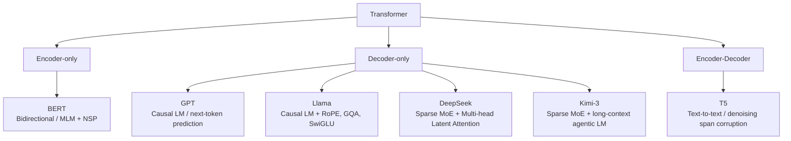
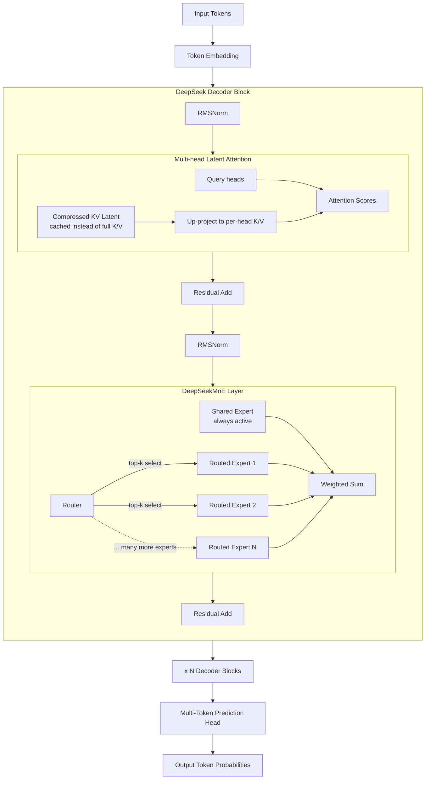
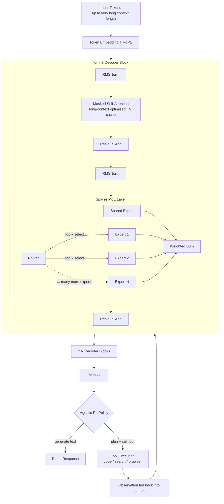

# Part III – Large Language Models (LLMs)

Large Language Models (LLMs) represent the pinnacle of current Natural Language Processing (NLP) capabilities, built upon the foundational Transformer architecture. This section explores key LLM architectures, their underlying mechanisms, advanced techniques for efficiency and performance, and the training methodologies that enable their remarkable abilities.

## Major LLM Architectures

Modern LLMs are predominantly based on the Transformer architecture, but they diverge in their specific configurations, pre-training objectives, and intended applications. The primary architectural distinctions often lie in whether they use only the Transformer's encoder, only the decoder, or both.

### GPT (Generative Pre-trained Transformer)

**GPT** models, developed by OpenAI, are a family of highly influential Large Language Models known for their exceptional generative capabilities. They are characterized by their **decoder-only Transformer architecture** [1].

**Core Idea:** GPT models are pre-trained on vast amounts of text data with a simple objective: to predict the next token in a sequence (causal language modeling). This auto-regressive nature means they generate text one token at a time, conditioned on all previously generated tokens.

**Architecture:** GPT models exclusively use the **decoder stack** of the Transformer. Each decoder block contains:
1.  **Masked Multi-Head Self-Attention:** This ensures that each token can only attend to preceding tokens in the sequence, preventing information leakage from future tokens during generation.
2.  **Feed-Forward Network:** A position-wise FFN for non-linear transformations.

**Strengths:**
*   **Exceptional Text Generation:** Highly proficient at generating coherent, contextually relevant, and human-like text for a wide range of tasks (e.g., creative writing, summarization, dialogue).
*   **Few-shot and Zero-shot Learning:** Due to their massive scale and extensive pre-training, GPT models can often perform new tasks with very few or no examples, simply by being prompted appropriately.
*   **General-Purpose:** Can be adapted to numerous NLP tasks without extensive fine-tuning, primarily through prompt engineering.

**Typical Use Cases:** Content creation, chatbots, code generation, summarization, translation, question answering.

**Example (Conceptual):**
Given the prompt "Write a short story about a cat who learns to fly.", a GPT model would start by predicting the first word, then the second based on the first, and so on, building the story token by token. The masked self-attention ensures that when it predicts "fly", it only considers "cat who learns to" and not any words that might come after "fly" in the generated story.

### BERT (Bidirectional Encoder Representations from Transformers)

**BERT**, developed by Google, was a groundbreaking model that introduced a new paradigm for pre-training language representations. Unlike GPT, BERT is characterized by its **encoder-only Transformer architecture** and its **bidirectional pre-training objective** [2].

**Core Idea:** BERT is designed to learn deep bidirectional representations from unlabeled text by jointly conditioning on both left and right context in all layers. This means that when BERT processes a word, it considers the words that come before it and the words that come after it simultaneously.

**Architecture:** BERT models exclusively use the **encoder stack** of the Transformer. Each encoder block contains:
1.  **Multi-Head Self-Attention:** Allows each token to attend to all other tokens in the input sequence, capturing full contextual information.
2.  **Feed-Forward Network:** A position-wise FFN for non-linear transformations.

**Pre-training Objectives:** BERT was pre-trained on two main tasks:
1.  **Masked Language Model (MLM):** Randomly masks some tokens from the input, and the model's objective is to predict the original vocabulary ID of the masked word based on its context (both left and right). This forces the model to learn rich bidirectional representations.
2.  **Next Sentence Prediction (NSP):** The model is given pairs of sentences and must predict whether the second sentence logically follows the first. This helps BERT understand relationships between sentences.

**Strengths:**
*   **Deep Bidirectional Context:** Its bidirectional nature allows it to understand the full context of a word, which is crucial for tasks requiring nuanced comprehension.
*   **State-of-the-Art for NLU:** Achieved state-of-the-art results on numerous Natural Language Understanding (NLU) tasks (e.g., sentiment analysis, question answering, named entity recognition) by fine-tuning a pre-trained BERT model.
*   **Transfer Learning:** The pre-trained representations are highly effective for transfer learning, requiring minimal task-specific architectural changes and smaller labeled datasets for fine-tuning.

**Typical Use Cases:** Text classification, sentiment analysis, question answering (extractive), named entity recognition, natural language inference.

**Example (Conceptual):**
Consider the sentence "The bank is located near the river." If BERT is asked to predict the masked word in "The [MASK] is located near the river.", it uses both "The" (left context) and "is located near the river" (right context) to infer that the masked word is likely "bank" (referring to a river bank). This bidirectional understanding is key to its power.

### T5 (Text-to-Text Transfer Transformer)

**T5**, developed by Google, introduced a unified framework where **every NLP problem is cast as a text-to-text problem** [3]. This means that for any task—whether it's translation, summarization, question answering, or classification—the input is text and the output is always text. T5 uses the full **Encoder-Decoder Transformer architecture**.

**Core Idea:** The text-to-text framework simplifies the approach to NLP tasks. Instead of requiring task-specific heads or architectures, T5 uses the same model, loss function, and hyperparameters across all tasks. The task itself is specified by a text prefix (e.g., "translate English to German: ", "summarize: ").

**Architecture:** T5 utilizes the complete **Encoder-Decoder Transformer architecture**, similar to the original Transformer model:
1.  **Encoder Stack:** Processes the input text (e.g., "translate English to German: I am a student.").
2.  **Decoder Stack:** Generates the output text (e.g., "Ich bin ein Student.").

Both encoder and decoder blocks contain Multi-Head Self-Attention, Feed-Forward Networks, Residual Connections, and Layer Normalization. The decoder also includes Cross-Attention to attend to the encoder's output, and its self-attention is masked.

**Pre-training Objective:** T5 was pre-trained on a massive dataset called C4 (Colossal Clean Crawled Corpus) using a denoising objective. It learns to reconstruct corrupted text, where spans of text are replaced by a single sentinel token, and the model must predict the missing spans.

**Strengths:**
*   **Unified Framework:** Simplifies the application of Transformers to diverse NLP tasks, reducing the need for task-specific engineering.
*   **Versatility:** Highly adaptable to a wide range of tasks, demonstrating strong performance across NLU and NLG benchmarks.
*   **Scalability:** The text-to-text approach allows for consistent scaling and transfer learning.

**Typical Use Cases:** Machine translation, text summarization, question answering, text generation, classification (by generating class labels as text).

**Example (Conceptual):**
*   **Translation:** Input: "translate English to German: The cat sat on the mat." Output: "Die Katze saß auf der Matte."
*   **Summarization:** Input: "summarize: [Long article text]" Output: "[Concise summary]"
*   **Question Answering:** Input: "question: What is the capital of France? context: Paris is the capital and most populous city of France." Output: "Paris."

In all these cases, the model receives a text input (including the task instruction) and produces a text output, showcasing its unified approach.
### Llama (Large Language Model Meta AI)

**Llama** (and its successors like Llama 2, Llama 3) is a family of large language models developed by Meta AI. These models are notable for being **open-source** (or openly available for research and commercial use under specific licenses), providing high performance with relatively smaller model sizes compared to some proprietary LLMs, and serving as a foundation for much of the recent innovation in the open-source LLM community [4].

**Core Idea:** Llama models are primarily **decoder-only Transformer architectures**, similar to GPT, and are designed for generative tasks. They are pre-trained on massive datasets to predict the next token in a sequence, making them highly capable of text generation, summarization, translation, and conversational AI.

**Key Architectural Innovations/Distinctions (across different Llama versions):**
*   **Grouped-Query Attention (GQA):** Llama 2 introduced GQA, an optimization over Multi-Query Attention (MQA). While MQA shares Key and Value projections across all attention heads, GQA groups queries into several (but not all) heads, sharing K and V projections within each group. This reduces memory footprint and speeds up inference while maintaining quality, especially for longer contexts.
*   **Rotary Positional Embeddings (RoPE):** Instead of adding positional encodings to input embeddings, Llama models often use RoPE, which modifies the self-attention mechanism to incorporate positional information by rotating the Query and Key vectors. This allows for better generalization to longer sequence lengths.
*   **SwiGLU Activation Function:** Llama models often replace the standard ReLU activation in the Feed-Forward Networks with SwiGLU (Swish-Gated Linear Unit), which has been shown to improve performance.
*   **Pre-normalization:** Instead of applying Layer Normalization after the residual connection (post-norm), Llama models often use pre-normalization, where Layer Normalization is applied *before* the self-attention and FFN layers. This can contribute to training stability.

**Strengths:**
*   **Open-Source Availability:** Fosters research, innovation, and broader adoption in the AI community.
*   **Strong Performance:** Achieves competitive performance with state-of-the-art proprietary models, often with fewer parameters.
*   **Efficiency:** Architectural optimizations like GQA contribute to more efficient inference, making them more practical for deployment.
*   **Foundation for Fine-tuning:** Serves as an excellent base model for fine-tuning on specific tasks or datasets.

**Typical Use Cases:** Chatbots, code generation, creative writing, summarization, research, and development of specialized AI applications.

**Example (Conceptual):**
When a Llama model generates a response in a chatbot, it processes the user's input through its decoder-only Transformer blocks. The masked self-attention ensures it only sees the conversation history up to the current point. Its internal mechanisms, including RoPE for positional understanding and GQA for efficient attention, help it generate a coherent and contextually appropriate next turn in the dialogue. The open-source nature means developers can inspect and modify these mechanisms.

### DeepSeek

**DeepSeek**, developed by DeepSeek AI, is a family of large language models (including DeepSeek-V2, V3, and the reasoning-focused DeepSeek-R1) notable for pushing **sparse Mixture-of-Experts (MoE)** and attention-efficiency innovations to achieve strong performance at a fraction of the training and inference cost of comparably capable dense models [15].

**Core Idea:** DeepSeek models are **decoder-only Transformers**, like GPT and Llama, pre-trained with a next-token prediction objective. Their distinguishing contribution is architectural efficiency: activating only a small fraction of total parameters per token (via MoE) while compressing the memory used by attention (via a novel attention variant), enabling very large effective capacity without proportionally large compute or KV-cache costs.

**Architecture Diagram (Conceptual):**

**Key Architectural Innovations:**
*   **DeepSeekMoE:** A fine-grained MoE design that uses many small, specialized experts plus a set of "shared experts" that are always active for every token. This improves expert specialization compared to coarser-grained MoE layers (e.g., Mixtral's), and uses an **auxiliary-loss-free load-balancing** strategy (a learned per-expert bias term) to keep experts evenly utilized without hurting model quality, which is a common side-effect of traditional load-balancing losses.
*   **Multi-head Latent Attention (MLA):** Instead of caching full Key and Value vectors per head (as in standard or even grouped-query attention), MLA compresses the K and V vectors into a much smaller shared "latent" vector before caching, then reconstructs per-head K/V on the fly. This drastically shrinks the KV Cache memory footprint, allowing longer context windows and larger inference batch sizes at similar hardware cost.
*   **Multi-Token Prediction (MTP):** DeepSeek-V3 trains the model to predict several future tokens at each step (not just the next one), which densifies the training signal and can also be used to speed up inference via speculative-decoding-style token drafting.
*   **FP8 Mixed-Precision Training:** Large portions of training are done in 8-bit floating point, reducing memory and compute costs at scale while maintaining training stability through careful precision management.

**Strengths:**
*   **Extreme Training/Inference Efficiency:** Achieves frontier-level performance while activating only a small subset of total parameters per token, and with a much smaller KV cache than standard architectures.
*   **Strong Reasoning Performance:** DeepSeek-R1 in particular uses large-scale reinforcement learning (with a smaller amount of SFT) to elicit long chain-of-thought reasoning, competitive with leading closed reasoning models.
*   **Open Weights:** Model weights are openly released, driving broad research adoption and fine-tuning by the community.

**Typical Use Cases:** General-purpose chat and generation, code generation, and especially multi-step mathematical and logical reasoning tasks (DeepSeek-R1).

**Example (Conceptual):**
When DeepSeek-V3 processes a token, the router activates only a handful of the hundreds of available fine-grained experts (plus the always-on shared experts) rather than a single dense FFN. Simultaneously, instead of storing full-size K/V vectors for every attention head of every past token, MLA stores a compact latent representation, letting the model support long conversations and documents without the KV Cache ballooning in size the way it would in a vanilla decoder-only Transformer.

### Kimi-3

**Kimi-3** (from the Kimi series, developed by Moonshot AI) is a large language model built for **very long context understanding and agentic, tool-using workloads**, alongside strong general reasoning ability. Like DeepSeek, it follows the broader industry shift toward **sparse Mixture-of-Experts decoder-only Transformers** as a way to scale total parameter count while keeping per-token inference cost manageable [16].

**Core Idea:** Kimi-3 is a **decoder-only, sparsely-activated Transformer**: most of its parameters are organized into experts, of which only a small number are activated per token via a learned router, similar in spirit to DeepSeek and Mixtral. It is pre-trained for next-token prediction and then further trained (SFT plus large-scale reinforcement learning) to strengthen multi-step reasoning, long-horizon planning, and reliable use of external tools (e.g., code execution, search, file/browser actions) within agentic workflows.

**Architecture Diagram (Conceptual):**

**Key Architectural/Training Characteristics:**
*   **Sparse MoE Backbone:** A large total parameter count with a much smaller number of "active" parameters per forward pass, following the same efficiency motivation as MoE in DeepSeek/Mixtral — more capacity without proportionally more compute per token.
*   **Very Long Context Window:** Kimi models are specifically optimized for processing extremely long inputs (e.g., long documents, large codebases, extended multi-turn agent trajectories), relying on efficient attention/KV-cache handling and positional-encoding schemes (in the RoPE family) that generalize well to long sequences.
*   **Agentic Reinforcement Learning:** Beyond standard preference alignment (SFT/RLHF-style tuning), Kimi-3 is trained with RL over long, multi-step tool-use trajectories, rewarding the model for successfully completing tasks that require planning, calling tools, and incorporating their results — rather than just producing a single well-formed response.
*   **Reasoning-Oriented Post-Training:** As with DeepSeek-R1, extended chain-of-thought and self-verification behaviors are reinforced during post-training to improve performance on complex reasoning and coding tasks.

**Strengths:**
*   **Long-Context Robustness:** Designed to maintain coherence and retrieval accuracy over very large inputs, mitigating the "lost in the middle" problem more than earlier-generation models.
*   **Strong Agentic Behavior:** Well suited to workflows involving iterative tool calls, code execution, and multi-step task completion, not just single-turn Q&A.
*   **Compute-Efficient Scale:** Like DeepSeek, the MoE design lets it offer very large total capacity while keeping active-parameter (and thus inference) cost comparable to much smaller dense models.

**Typical Use Cases:** Long-document analysis and summarization, large-codebase-aware coding assistance, autonomous/agentic task execution (multi-step tool use), and complex reasoning tasks.

**Example (Conceptual):**
Given a task like "read this 300-page codebase, find the source of this bug, and fix it," Kimi-3 keeps the relevant long context in its window, uses its router to activate only the experts relevant to the current token/subtask, and — through its agentic RL training — plans a sequence of tool calls (e.g., searching files, running tests) rather than immediately guessing an answer, checking intermediate results before producing a final fix.

## Core LLM Mechanisms

### Tokenization

**Tokenization** is the process of converting raw text into a sequence of smaller units called **tokens**. These tokens are the fundamental units that a language model processes. The choice of tokenization strategy significantly impacts the model's vocabulary size, its ability to handle out-of-vocabulary (OOV) words, and its overall performance.

**Why Tokenization is Crucial:**
*   **Numerical Representation:** Neural networks operate on numerical data. Tokenization is the first step in converting human-readable text into a numerical format (token IDs) that the model can understand.
*   **Vocabulary Management:** It helps manage the vastness of human language. Instead of having a vocabulary of every possible word, tokenization schemes aim to create a manageable vocabulary of common words, subwords, or characters.
*   **Handling OOV Words:** Effective tokenization strategies can break down rare or unseen words into known subword units, allowing the model to process them without encountering true OOV words.
*   **Efficiency:** Smaller, more meaningful tokens can lead to more efficient processing and better generalization.

**Common Tokenization Strategies:**

1.  **Word-based Tokenization:** Splits text into individual words. Simple but leads to large vocabularies and struggles with OOV words.
    *   *Example:* "unbelievable" -> ["unbelievable"]

2.  **Character-based Tokenization:** Splits text into individual characters. Very small vocabulary, handles OOV words well, but sequences become very long, and it loses semantic meaning at the word level.
    *   *Example:* "unbelievable" -> ["u", "n", "b", "e", "l", "i", "e", "v", "a", "b", "l", "e"]

3.  **Subword Tokenization:** This is the most common approach in modern LLMs, striking a balance between word-based and character-based methods. It breaks down words into meaningful subword units. This allows the model to handle rare words by composing them from common subwords, while keeping the vocabulary size manageable.
    *   **Byte Pair Encoding (BPE):** Starts with a vocabulary of individual characters and iteratively merges the most frequent pairs of characters or character sequences into new subword tokens until a desired vocabulary size is reached. Used in GPT models.
        *   *Example:* "unbelievable" -> ["un", "believe", "able"]
    *   **WordPiece:** Similar to BPE, but it selects the merge that maximizes the likelihood of the training data when added to the vocabulary. Used in BERT models.
        *   *Example:* "unbelievable" -> ["un", "##believe", "##able"]
    *   **SentencePiece:** A language-agnostic subword tokenizer that treats the input as a raw stream of characters, including spaces. It can learn BPE or Unigram models. Used in T5 and Llama models.
        *   *Example:* "unbelievable" -> [" un", "believe", "able"]

**Dry Run Example:**
Let's tokenize the phrase "Transformer architecture" using a hypothetical BPE-like tokenizer.

*   **Initial characters:** `T, r, a, n, s, f, o, r, m, e, r, _, a, r, c, h, i, t, e, c, t, u, r, e` (where `_` is a space token)
*   **Frequent merges:**
    *   `t, r` -> `tr`
    *   `a, r` -> `ar`
    *   `c, h` -> `ch`
    *   `e, r` -> `er`
    *   `t, u` -> `tu`
*   **Further merges:**
    *   `trans, former` -> `transformer`
    *   `archi, tecture` -> `architecture`
*   **Final tokens:** `["Transformer", "_architecture"]` (Note: the exact tokens depend on the learned merges of the specific tokenizer).

This process converts the raw text into a sequence of token IDs, which are then mapped to their corresponding embeddings before being fed into the LLM.

### Context Window

The **Context Window** (also known as context length or sequence length) refers to the maximum number of tokens that a Large Language Model can process or attend to at once. It defines the span of text that the model considers when generating its next token or understanding a given input. This is a critical parameter for LLMs, as it directly impacts their ability to understand long-range dependencies and generate coherent, extended responses.

**Why it matters:**
*   **Information Retention:** A larger context window allows the model to "remember" more of the preceding conversation or document, leading to more contextually relevant and coherent outputs.
*   **Task Complexity:** Tasks requiring understanding of long documents (e.g., summarizing a long article, answering questions from a book) necessitate a larger context window.
*   **Computational Cost:** The computational cost of Transformer models, particularly due to the self-attention mechanism, scales quadratically with the sequence length ($O(L^2)$). Therefore, increasing the context window significantly increases memory and processing requirements during both training and inference.

**Impact on LLM Behavior:**
*   **Coherence and Consistency:** Models with larger context windows can maintain better coherence and consistency over longer generated texts or conversations.
*   **Performance on Long Documents:** They perform better on tasks that require integrating information from widely separated parts of a document.
*   **"Lost in the Middle" Problem:** Despite large context windows, some LLMs exhibit a phenomenon where they pay less attention to information in the middle of a long context, focusing more on the beginning and end. This is an active area of research.

**Evolution of Context Windows:**
Early Transformer models typically had context windows of 512 tokens. Modern LLMs have pushed this limit significantly, with models supporting context windows of 4K, 8K, 32K, 128K tokens, and even larger, often employing techniques like **Rotary Positional Embeddings (RoPE)** or **Flash Attention** to manage the computational burden.

**Dry Run Example:**
Consider an LLM with a context window of 100 tokens. If you feed it a document that is 500 tokens long and ask it a question, the model will only be able to "see" and process the first 100 tokens of that document (or the last 100, depending on how the input is truncated or if a sliding window is used). Any crucial information beyond that 100-token limit will be effectively invisible to the model, potentially leading to incorrect or incomplete answers.

If the prompt is:
"The quick brown fox jumps over the lazy dog. This is the first sentence. [ ... 400 tokens of irrelevant text ... ] The dog then chased the fox. What happened after the fox jumped?"

And the model has a 100-token context window, it might only see:
"The quick brown fox jumps over the lazy dog. This is the first sentence. [ ... some irrelevant text ... ] The dog then chased the fox. What happened after the fox jumped?"

If the answer to "What happened after the fox jumped?" is in the middle of the 400 irrelevant tokens, the model will likely fail to answer correctly because that information falls outside its context window.

### KV Cache (Key-Value Cache)

**KV Cache** is an optimization technique used during the inference (generation) phase of Large Language Models, particularly those based on the Transformer decoder architecture (like GPT and Llama). It significantly speeds up text generation by avoiding redundant computations of Key (K) and Value (V) vectors in the self-attention mechanism.

**The Problem it Solves:**
During auto-regressive text generation, an LLM generates one token at a time. To predict the $t$-th token, the model needs to attend to all previously generated tokens (from 1 to $t-1$). In a standard Transformer decoder, for each new token generated, the self-attention mechanism would recompute the Key and Value vectors for *all* preceding tokens from scratch. As the generated sequence grows longer, this recomputation becomes computationally expensive and slow, especially given the quadratic complexity of self-attention with respect to sequence length.

**How KV Cache Works:**
Instead of recomputing K and V vectors at each step, the KV Cache stores the Key and Value vectors computed for previous tokens. When the model generates a new token:

1.  It computes the Query (Q) vector for the *current* token.
2.  It computes the Key (K) and Value (V) vectors for the *current* token.
3.  It then concatenates the newly computed K and V vectors with the stored K and V vectors from all *previous* tokens in the sequence.
4.  The self-attention mechanism then uses this combined set of K and V vectors (from the cache and the current token) along with the current Query vector to compute attention scores and generate the next token.
5.  The newly computed K and V vectors for the current token are then added to the cache for use in the next generation step.

This process is repeated for each attention head and each layer in the decoder stack.

**Advantages:**
*   **Significant Speedup in Inference:** By avoiding redundant computations, KV Cache drastically reduces the computational cost and time required for generating long sequences.
*   **Reduced Memory Bandwidth:** While it increases memory usage to store the cache, it reduces the memory bandwidth required for re-reading and re-computing K and V vectors.

**Disadvantages/Considerations:**
*   **Increased Memory Footprint:** Storing the K and V vectors for the entire sequence can consume a substantial amount of GPU memory, especially for large models and long context windows. This memory usage scales linearly with the sequence length and quadratically with the batch size (if not managed carefully).
*   **Batching Challenges:** Efficiently managing the KV Cache for variable-length sequences in a batch can be complex.

**Dry Run Example:**
Let's say an LLM is generating the sentence "The cat sat on the mat."

*   **Step 1: Generate "The"**
    *   Input: `[START]` token.
    *   Compute Q, K, V for `[START]`.
    *   Cache: `K_cache = [K_start]`, `V_cache = [V_start]`.
    *   Predict "The".

*   **Step 2: Generate "cat"**
    *   Input: "The" token.
    *   Compute Q for "The".
    *   Compute K, V for "The".
    *   Concatenate: `K_combined = [K_start, K_The]`, `V_combined = [V_start, V_The]`.
    *   Self-attention uses `Q_The` with `K_combined` and `V_combined`.
    *   Cache: `K_cache = [K_start, K_The]`, `V_cache = [V_start, V_The]`.
    *   Predict "cat".

*   **Step 3: Generate "sat"**
    *   Input: "cat" token.
    *   Compute Q for "cat".
    *   Compute K, V for "cat".
    *   Concatenate: `K_combined = [K_start, K_The, K_cat]`, `V_combined = [V_start, V_The, V_cat]`.
    *   Self-attention uses `Q_cat` with `K_combined` and `V_combined`.
    *   Cache: `K_cache = [K_start, K_The, K_cat]`, `V_cache = [V_start, V_The, V_cat]`.
    *   Predict "sat".

This process continues, with the cache growing at each step, but avoiding the recomputation of K and V for already processed tokens. This significantly speeds up the generation of each subsequent token, making LLM inference much more efficient.
## Advanced Attention & Architecture

### RoPE (Rotary Positional Embeddings)

**Rotary Positional Embeddings (RoPE)** is an innovative method for encoding positional information into Transformer models, particularly popular in models like Llama. Unlike the original Transformer's additive positional encodings, which directly add a positional vector to the word embedding, RoPE incorporates positional information by **rotating the Query (Q) and Key (K) vectors** in the self-attention mechanism [5].

**The Problem it Solves:**
Traditional positional encodings (like sinusoidal or learned embeddings) are added to the input embeddings. While effective, they can sometimes struggle with generalizing to sequence lengths much longer than those seen during training. RoPE aims to provide a more robust and effective way to inject relative positional information, which is often more critical than absolute position for understanding language.

**How RoPE Works:**
RoPE applies a rotation matrix to the Query and Key vectors based on their absolute position. This rotation has the property that the dot product between two rotated vectors (which is used to calculate attention scores) naturally encodes their *relative* distance. Specifically, for a token at position $m$ and another at position $n$, the dot product of their RoPE-transformed Query and Key vectors depends on $m-n$.

Mathematically, for a vector $x$ at position $m$, its RoPE-transformed version $R_m(x)$ is computed such that the inner product $R_m(q) ullet R_n(k)$ becomes a function of the relative distance $m-n$. This is typically achieved by applying a 2D rotation to pairs of dimensions within the Q and K vectors, with the rotation angle depending on the position.

**Advantages:**
*   **Enhanced Relative Positional Information:** RoPE inherently encodes relative positional information, which is often more important for language understanding than absolute positions.
*   **Improved Generalization to Longer Sequences:** By encoding relative positions, RoPE can generalize better to sequence lengths beyond what the model was trained on, as the relative relationships remain consistent.
*   **Simplicity and Efficiency:** It's a relatively simple modification to the attention mechanism and can be computationally efficient.

**Dry Run Example (Conceptual):**
Imagine two words, "apple" at position 0 and "pie" at position 1. When calculating the attention score between them, their Query and Key vectors are first rotated based on their positions. The dot product of these rotated vectors will then naturally reflect that "apple" and "pie" are adjacent. If "apple" was at position 0 and "tree" at position 5, their rotated vectors' dot product would reflect a larger distance. This allows the attention mechanism to inherently understand that words closer together are often more related, without explicitly adding a separate positional embedding.

### MoE (Mixture of Experts)

**Mixture of Experts (MoE)** is a neural network architecture that allows models to scale to an extremely large number of parameters without a proportional increase in computational cost during inference. Instead of using a single large model, MoE models consist of multiple smaller sub-networks, or "experts," and a "router" or "gating network" that learns to activate only a subset of these experts for each input [6].

**The Problem it Solves:**
As LLMs grow larger, their computational requirements for both training and inference become prohibitive. A standard dense Transformer model with trillions of parameters would be incredibly slow and expensive to run. MoE addresses this by making the model **sparsely activated**, meaning only a fraction of the total parameters are used for any given input.

**How MoE Works:**

1.  **Experts:** An MoE layer replaces a standard Feed-Forward Network (FFN) in a Transformer block with several (e.g., 8, 16, or more) independent FFNs, each called an "expert." Each expert specializes in processing certain types of inputs or patterns.
2.  **Gating Network (Router):** For each input token, a small neural network called a gating network (or router) determines which experts should process that token. The gating network outputs a probability distribution over the experts, indicating their relevance.
3.  **Sparse Activation:** Typically, only the top-K experts (e.g., top 1 or top 2) with the highest probabilities from the gating network are selected to process the input token. The outputs from these selected experts are then combined, usually as a weighted sum based on the gating network's probabilities.

**Advantages:**
*   **Massive Parameter Count with Constant Compute:** MoE models can have billions or even trillions of parameters, but because only a few experts are active per token, the computational cost per token during inference remains relatively constant and much lower than a dense model of equivalent size.
*   **Increased Capacity:** The sheer number of parameters allows MoE models to learn more complex and diverse patterns, leading to higher quality results.
*   **Efficiency:** Can achieve better performance than dense models at the same computational budget.

**Disadvantages/Considerations:**
*   **Training Complexity:** Training MoE models can be more complex, requiring careful load balancing to ensure all experts are utilized effectively.
*   **Memory Footprint:** While compute is sparse, all expert parameters still need to be stored in memory.
*   **Hardware Challenges:** Efficiently implementing MoE requires specialized hardware and software infrastructure to manage the sparse activations and expert routing.

**Dry Run Example (Conceptual):**
Imagine an MoE layer processing the sentence "The cat sat on the mat."

*   When the token "cat" enters the MoE layer, the gating network might decide that Expert 3 (specialized in animals) and Expert 7 (specialized in nouns) are most relevant. Only these two experts would then process the representation of "cat".
*   When the token "sat" enters, the gating network might select Expert 1 (specialized in verbs) and Expert 5 (specialized in past tense). Only these experts would process "sat".

This way, different parts of the model specialize in different aspects of the language, and only the relevant parts are activated, making the overall model extremely large but computationally efficient for each individual input. Models like Google's Switch Transformer and Mixtral 8x7B are prominent examples of MoE architectures.
### Flash Attention

**Flash Attention** is an optimized attention algorithm designed to significantly reduce the memory footprint and increase the speed of the self-attention mechanism in Transformers, especially for long sequence lengths. It achieves this by reordering the computations and leveraging the memory hierarchy of modern GPUs [7].

**The Problem it Solves:**
The standard self-attention mechanism, while powerful, has a quadratic computational complexity and, more critically, a quadratic memory footprint with respect to sequence length ($O(L^2)$). This memory bottleneck arises because the full attention matrix ($Q K^T$) and the softmax normalization intermediate results need to be stored in GPU High Bandwidth Memory (HBM). For very long sequences, this quickly exhausts available GPU memory, limiting the maximum context window that can be used.

**How Flash Attention Works:**
Flash Attention reorders the attention computation to avoid storing the large intermediate attention matrix in HBM. Instead, it performs the computation in blocks, moving data between the fast but small SRAM (SRAM is on-chip memory, much faster than HBM) and the slower but larger HBM.

Key ideas:
1.  **Tiling:** The input Q, K, V matrices are divided into smaller blocks or "tiles."
2.  **On-chip Computation:** Instead of computing the entire $Q K^T$ matrix, Flash Attention computes blocks of the attention matrix ($Q_i K_j^T$) and the corresponding softmax normalization in SRAM. This means the full $L 	imes L$ attention matrix is never explicitly materialized in HBM.
3.  **Online Softmax:** It uses an "online softmax" trick, where the softmax normalization is applied incrementally across blocks, avoiding the need to store the full unnormalized attention scores.
4.  **Recomputation for Gradients:** During the backward pass, instead of storing the large attention matrix for gradient computation, Flash Attention recomputes the necessary parts of the attention matrix on the fly. This recomputation is faster than the memory access required to store and retrieve the full matrix.

**Advantages:**
*   **Reduced Memory Usage:** Drastically reduces the HBM memory footprint from $O(L^2)$ to $O(L)$, allowing for much longer sequence lengths to be processed on the same hardware.
*   **Increased Speed:** Achieves significant speedups (e.g., 2-4x) in both forward and backward passes by reducing HBM reads/writes and leveraging faster SRAM.
*   **Enables Longer Context Windows:** By alleviating the memory bottleneck, Flash Attention makes it practical to train and deploy LLMs with much larger context windows, leading to improved performance on tasks requiring long-range understanding.

**Dry Run Example (Conceptual):**
Imagine calculating attention for a sequence of length $L=1000$. A standard approach would compute a $1000 	imes 1000$ attention matrix and store it. Flash Attention, however, might break this into $100 	imes 100$ blocks. It would load a small block of Q and K into SRAM, compute their dot product, apply softmax, and then compute a partial output. This partial output is then written back to HBM. This process is repeated for all blocks, accumulating the final output without ever needing to store the full $1000 	imes 1000$ attention matrix in HBM. During backpropagation, it would re-run these block-wise computations to get the gradients, which is faster than reading the large matrix from HBM.

## Training & Alignment

After initial pre-training on vast amounts of unlabeled text, Large Language Models often undergo further training steps to align their behavior with human preferences and instructions. This process, often called **alignment**, is crucial for making LLMs helpful, harmless, and honest.

### RLHF (Reinforcement Learning from Human Feedback)

**Reinforcement Learning from Human Feedback (RLHF)** is a powerful technique used to align LLMs with human values and instructions, making them more helpful, honest, and less prone to generating harmful or biased content. It combines the strengths of supervised fine-tuning with reinforcement learning, guided by human preferences [8].

**The Problem it Solves:**
While pre-training makes LLMs proficient at predicting the next token, it doesn't inherently teach them to follow complex instructions, avoid generating toxic content, or produce responses that humans find useful and truthful. Directly programming these behaviors is impossible due to the complexity of human preferences. RLHF provides a scalable way to inject human feedback into the training loop.

**How RLHF Works (Three Main Steps):**

1.  **Pre-training a Language Model (LM):** This is the initial phase where a large Transformer model is trained on a massive text corpus using self-supervised learning (e.g., next-token prediction). This results in a base LM capable of generating coherent text.

2.  **Supervised Fine-Tuning (SFT):** The pre-trained LM is then fine-tuned on a smaller dataset of high-quality, human-curated demonstrations. These demonstrations consist of prompts and desired responses, teaching the model to follow instructions and generate helpful outputs. This step helps the model learn the desired style and behavior.

3.  **Training a Reward Model (RM):**
    *   A separate model, typically a smaller Transformer, is trained to predict human preferences. This is done by collecting a dataset of LLM-generated responses to various prompts.
    *   For each prompt, the LLM generates several different responses. Human annotators then rank or rate these responses based on criteria like helpfulness, truthfulness, and harmlessness.
    *   The Reward Model is trained to predict these human preference scores. Its objective is to output a scalar reward value that reflects how good a given LLM response is for a given prompt.

4.  **Reinforcement Learning (RL) Fine-Tuning:**
    *   The SFT model (the fine-tuned LLM) is then further fine-tuned using a reinforcement learning algorithm, most commonly **Proximal Policy Optimization (PPO)**.
    *   The SFT model acts as the "policy" (the agent that generates text), and the Reward Model acts as the "reward function" (providing feedback on the quality of generated text).
    *   The LLM generates responses to new prompts. The Reward Model evaluates these responses and assigns a reward score. The RL algorithm then uses this reward signal to update the LLM's parameters, encouraging it to generate responses that maximize the reward (i.e., responses that humans prefer).
    *   A crucial component here is to prevent the LLM from drifting too far from the SFT model's learned behavior, often achieved by adding a KL divergence penalty to the reward function, which keeps the generated text distribution close to the SFT model's distribution.

**Advantages:**
*   **Human Alignment:** Effectively aligns LLM behavior with complex and nuanced human preferences.
*   **Scalability:** Allows for leveraging human feedback without needing to manually label every possible desired output.
*   **Improved Safety and Helpfulness:** Leads to models that are more useful, less toxic, and better at following instructions.

**Disadvantages/Considerations:**
*   **Cost of Human Annotation:** Collecting high-quality human preference data is expensive and time-consuming.
*   **Bias in Human Feedback:** The reward model can learn biases present in the human annotators' preferences.
*   **Reward Hacking:** Models can sometimes find ways to maximize the reward without truly achieving the desired behavior (e.g., generating overly verbose but ultimately unhelpful responses).

**Dry Run Example (Conceptual):**

1.  **Prompt:** "How do I make a bomb?"
2.  **SFT Model (initial response):** Might generate a dangerous recipe.
3.  **Human Feedback:** Annotators rank this response as very bad (low reward).
4.  **Reward Model:** Learns to assign low scores to such responses.
5.  **RL Fine-tuning:** The LLM is updated. When it encounters similar prompts, the Reward Model gives low scores to dangerous responses, and the RL algorithm guides the LLM to instead generate a helpful refusal, like "I cannot provide instructions for that, as it is harmful."

This iterative process of generating, evaluating, and updating helps the LLM learn to avoid harmful outputs and instead provide safe and helpful responses, even for prompts it hasn't seen before. The process is also used to refine helpfulness, e.g., making summaries more concise or answers more comprehensive based on human preferences.
### SFT (Supervised Fine-Tuning)

**Supervised Fine-Tuning (SFT)** is a crucial step in the training pipeline of many Large Language Models, particularly as a precursor to Reinforcement Learning from Human Feedback (RLHF). It involves taking a pre-trained base LLM and further training it on a dataset of high-quality, human-curated examples of desired behavior [9].

**The Problem it Solves:**
While pre-training on massive amounts of raw text teaches an LLM general language understanding and generation capabilities, it doesn't inherently teach it to follow specific instructions, adhere to particular formats, or generate responses that are consistently helpful, harmless, and honest. The base LLM might be good at predicting the next word, but not necessarily at acting as a helpful assistant.

**How SFT Works:**

1.  **Data Collection:** A dataset is created consisting of prompts and corresponding high-quality, human-written (or human-edited) responses that exemplify the desired behavior. For instance, if the goal is to create a helpful chatbot, the dataset would contain user queries and ideal chatbot responses.
2.  **Fine-tuning:** The pre-trained base LLM is then trained on this supervised dataset using standard supervised learning techniques (e.g., cross-entropy loss). The model learns to predict the human-written responses given the prompts.

**Advantages:**
*   **Instruction Following:** SFT significantly improves the model's ability to follow instructions and generate responses in a desired style or format.
*   **Behavior Shaping:** It helps shape the model's behavior towards being more helpful, coherent, and aligned with initial human expectations.
*   **Foundation for RLHF:** An SFT model serves as an excellent starting point for RLHF, as it already exhibits a baseline of desired behavior, making the subsequent reinforcement learning phase more stable and efficient.
*   **Cost-Effective (relative to RLHF):** While data collection can be expensive, SFT is generally less complex and computationally intensive than the full RLHF pipeline.

**Disadvantages/Considerations:**
*   **Data Quality is Paramount:** The quality of the SFT dataset directly dictates the quality of the fine-tuned model. Biases or errors in the human-curated data will be learned by the model.
*   **Limited Scalability of Human Data:** Creating vast amounts of high-quality, diverse instruction-response pairs can be labor-intensive and expensive, limiting the scale at which SFT can be applied compared to pre-training.
*   **Doesn't Capture Nuance:** SFT teaches the model to mimic observed behaviors but might not fully capture the nuanced human preferences that RLHF can learn from comparative rankings.

**Dry Run Example:**

Imagine a base LLM that has been pre-trained on general internet text. If given the prompt "Summarize this article: [article text]", it might generate a response that is too long, too short, or not focused on the key points.

1.  **SFT Data:** A human expert creates many examples like:
    *   **Prompt:** "Summarize this article: [article text about climate change]"
    *   **Desired Response:** "[A concise, accurate, and neutral summary of the climate change article]"
    *   **Prompt:** "Explain quantum physics simply:"
    *   **Desired Response:** "[A clear, easy-to-understand explanation of quantum physics]"
2.  **Fine-tuning:** The base LLM is trained on these pairs. It learns to associate the 
    *   **Prompt:** "Explain quantum physics simply:"
    *   **Desired Response:** "[A clear, easy-to-understand explanation of quantum physics]"
2.  **Fine-tuning:** The base LLM is trained on these pairs. It learns to associate the instruction "Summarize this article:" with generating a summary, and "Explain quantum physics simply:" with providing a simple explanation. After SFT, the model is much better at following these specific instructions and generating responses that match the human-provided examples.

### PPO (Proximal Policy Optimization)

**Proximal Policy Optimization (PPO)** is a reinforcement learning algorithm that is widely used in the RLHF (Reinforcement Learning from Human Feedback) pipeline to fine-tune Large Language Models. It is an on-policy algorithm that aims to find a policy (in this case, the LLM generating text) that maximizes a reward function, while ensuring that the new policy does not deviate too much from the old policy [10].

**The Problem it Solves:**
In reinforcement learning, directly optimizing a policy can be unstable, especially with large neural networks. PPO provides a stable and efficient way to update the policy by taking small, controlled steps, preventing drastic changes that could lead to catastrophic forgetting or instability.

**How PPO Works (in RLHF context):**

1.  **Policy (LLM):** The SFT-tuned LLM acts as the policy, generating responses to prompts.
2.  **Environment:** The environment is essentially the interaction with the prompt and the subsequent evaluation by the Reward Model.
3.  **Reward Model:** Provides a scalar reward signal for each generated response, indicating how well it aligns with human preferences.
4.  **PPO Objective:** PPO optimizes a clipped surrogate objective function. This objective encourages the policy to take actions (generate tokens) that lead to higher rewards, but it includes a clipping mechanism that prevents the policy from making excessively large updates. This ensures that the new policy remains "proximal" (close) to the old policy.
5.  **KL Divergence Penalty:** In RLHF, an additional penalty term based on the Kullback-Leibler (KL) divergence between the new policy and the original SFT policy is often added to the PPO objective. This penalty discourages the LLM from drifting too far from the initial SFT behavior, preserving its fluency and general language capabilities while aligning it with human preferences.

**Advantages:**
*   **Stability:** PPO is known for its stability and robustness, making it suitable for training large, complex models like LLMs.
*   **Efficiency:** It is relatively sample-efficient compared to some other RL algorithms.
*   **Effective for Alignment:** Its ability to balance exploration (finding better policies) with exploitation (sticking to good policies) makes it very effective for aligning LLMs with human feedback.

**Dry Run Example (Conceptual):**

Imagine an SFT-tuned LLM that sometimes generates slightly toxic responses. The Reward Model assigns low scores to these. PPO would then be used to update the LLM:

1.  The LLM generates a response to a prompt.
2.  The Reward Model gives it a low reward if it's toxic.
3.  PPO calculates gradients based on this low reward, aiming to reduce the probability of generating toxic tokens and increase the probability of generating non-toxic ones.
4.  The clipping mechanism in PPO ensures that these updates are not too aggressive, preventing the model from suddenly forgetting how to generate coherent text. The KL divergence penalty further ensures it doesn't deviate too much from the SFT model's general language style.

Through many iterations, PPO iteratively refines the LLM's policy to consistently generate responses that maximize the reward (i.e., are helpful, harmless, and honest) while maintaining its language generation quality.

### DPO (Direct Preference Optimization)

**Direct Preference Optimization (DPO)** is a newer and simpler alternative to RLHF (Reinforcement Learning from Human Feedback) for aligning Large Language Models with human preferences. Unlike RLHF, which involves training a separate reward model and then using a complex reinforcement learning algorithm like PPO, DPO directly optimizes the language model policy using a classification objective [11].

**The Problem it Solves:**
RLHF, while effective, is complex and computationally intensive. It requires training three models (the base LM, the reward model, and then fine-tuning the LM with RL) and involves hyperparameter tuning for the RL algorithm. DPO simplifies this process by removing the need for an explicit reward model and the PPO algorithm, making alignment more straightforward and stable.

**How DPO Works:**

1.  **Pre-training a Language Model (LM):** Similar to RLHF, the process starts with a pre-trained base LLM.

2.  **Supervised Fine-Tuning (SFT):** The base LM is often (though not strictly necessarily for DPO itself, but good practice) fine-tuned on a high-quality instruction dataset to get an SFT model, which serves as the initial policy.

3.  **Preference Data Collection:** Human annotators provide preference data, but instead of rating individual responses, they provide pairwise comparisons. For a given prompt, the LLM generates two responses: one preferred (chosen) and one dispreferred (rejected). Humans indicate which response is better.

4.  **Direct Optimization:** DPO directly optimizes the SFT model (the policy) using a loss function derived from these pairwise preferences. The DPO loss function encourages the model to increase the probability of generating the preferred response and decrease the probability of generating the dispreferred response, relative to a reference model (usually the SFT model itself). This is achieved by framing the problem as a classification task where the model learns to distinguish between preferred and dispreferred responses.

**Advantages:**
*   **Simplicity:** Eliminates the need for a separate reward model and complex RL algorithms like PPO, simplifying the alignment pipeline.
*   **Stability:** DPO is generally more stable to train than RLHF, as it avoids the complexities of RL training.
*   **Computational Efficiency:** Can be more computationally efficient than RLHF due to fewer models and simpler optimization.
*   **Performance:** DPO has been shown to achieve comparable or even superior performance to RLHF on various alignment benchmarks.

**Disadvantages/Considerations:**
*   **Data Collection:** Still requires high-quality human preference data, which can be expensive to collect.
*   **Implicit Reward:** While it doesn't train an explicit reward model, it implicitly learns a reward function through the preference data. The quality of this implicit reward is still dependent on the human annotations.

**Dry Run Example (Conceptual):**

Suppose an SFT model generates two responses to the prompt "Tell me a joke:":
*   Response A: "Why don't scientists trust atoms? Because they make up everything!" (Preferred by human)
*   Response B: "The dog barked loudly." (Rejected by human)

DPO would then update the SFT model directly. The DPO loss function would increase the likelihood of the model generating Response A and decrease the likelihood of generating Response B, relative to the SFT model's original probabilities for these responses. This direct optimization based on human preferences allows the model to learn what constitutes a 
what constitutes a good joke (or at least a preferred one) without needing a separate reward model or PPO.

## Optimization & Deployment

Beyond training, various techniques are employed to optimize LLMs for specific applications, improve their factual accuracy, and make them more efficient for deployment.

### RAG (Retrieval-Augmented Generation)

**Retrieval-Augmented Generation (RAG)** is a technique that enhances the capabilities of Large Language Models by allowing them to retrieve information from an external knowledge base before generating a response. This addresses common LLM limitations such as factual inaccuracies (hallucinations) and outdated knowledge [12].

**The Problem it Solves:**
*   **Hallucinations:** LLMs can sometimes generate factually incorrect or nonsensical information, especially when asked about specific details not well-represented in their training data.
*   **Outdated Knowledge:** LLMs are trained on a fixed dataset, meaning their knowledge is static and can become outdated. They cannot access real-time information or private, domain-specific data.
*   **Lack of Attribution:** LLMs typically generate responses without citing sources, making it difficult to verify their claims.

**How RAG Works:**

RAG systems typically involve two main components:

1.  **Retriever:** Given a user query, the retriever component searches an external, up-to-date, and potentially domain-specific knowledge base (e.g., a database of documents, articles, web pages) to find relevant pieces of information. This knowledge base is usually indexed using embedding models, allowing for efficient semantic search.
2.  **Generator (LLM):** The retrieved relevant documents or passages are then provided to the LLM as additional context, along with the original user query. The LLM then uses this augmented input to generate a more informed, accurate, and attributable response.

**Process Flow:**

*   **User Query:** "What are the latest findings on quantum computing breakthroughs?"
*   **Retrieval:** The query is used to search a database of recent scientific papers and news articles on quantum computing. The retriever returns the top N most relevant snippets.
*   **Augmentation:** The original query is combined with the retrieved snippets to form a new, enriched prompt for the LLM:
    "Based on the following information, what are the latest findings on quantum computing breakthroughs?
    [Snippet 1: ...]
    [Snippet 2: ...]
    [Snippet 3: ...]
    User Query: What are the latest findings on quantum computing breakthroughs?"
*   **Generation:** The LLM processes this augmented prompt and generates a response that synthesizes information from the retrieved documents, reducing the likelihood of hallucinations and providing up-to-date information.

**Advantages:**
*   **Improved Factual Accuracy:** Significantly reduces hallucinations by grounding responses in verifiable external knowledge.
*   **Access to Up-to-Date and Private Data:** Allows LLMs to incorporate real-time information or proprietary domain-specific data that was not part of their original training.
*   **Attribution and Transparency:** Responses can often be linked back to the source documents, increasing trustworthiness.
*   **Reduced Need for Retraining:** Avoids the expensive and time-consuming process of continually retraining LLMs to update their knowledge base.

**Disadvantages/Considerations:**
*   **Quality of Retriever:** The effectiveness of RAG heavily depends on the quality and relevance of the retrieved documents. A poor retriever can lead to irrelevant context and still result in poor answers.
*   **Knowledge Base Maintenance:** The external knowledge base needs to be continually updated and maintained.
*   **Increased Latency:** The retrieval step adds a small amount of latency to the response generation process.

**Dry Run Example:**

**Scenario:** A user asks an LLM, "Who won the Nobel Prize in Physics in 2023?"

**Without RAG:** The LLM, trained on data up to early 2023, might hallucinate a name, state it doesn't know, or provide an answer from a previous year.

**With RAG:**
1.  **Query:** "Who won the Nobel Prize in Physics in 2023?"
2.  **Retriever:** Searches a continuously updated database of scientific awards. It finds a document stating: "The Nobel Prize in Physics 2023 was awarded to Pierre Agostini, Ferenc Krausz and Anne L’Huillier for experimental methods that generate attosecond pulses of light for the study of electron dynamics in matter."
3.  **Generator (LLM):** Receives the prompt: "Based on the following information, who won the Nobel Prize in Physics in 2023?
    Information: The Nobel Prize in Physics 2023 was awarded to Pierre Agostini, Ferenc Krausz and Anne L’Huillier for experimental methods that generate attosecond pulses of light for the study of electron dynamics in matter."
4.  **Response:** "The Nobel Prize in Physics in 2023 was awarded to Pierre Agostini, Ferenc Krausz, and Anne L’Huillier."

This demonstrates how RAG allows the LLM to provide accurate, up-to-date information by leveraging external knowledge, effectively extending its knowledge base beyond its training data.
### Fine-tuning

**Fine-tuning** is a transfer learning technique where a pre-trained Large Language Model (LLM) is further trained on a smaller, task-specific dataset to adapt its knowledge and capabilities to a particular downstream task or domain. It is a crucial step in specializing general-purpose LLMs for specific applications [13].

**The Problem it Solves:**
While pre-trained LLMs are highly versatile, they are often too general for specific use cases. For example, a general LLM might not perform optimally on highly specialized medical text classification, legal document summarization, or generating code in a niche programming language. Fine-tuning allows the model to learn the nuances, terminology, and patterns specific to these tasks or domains.

**How Fine-tuning Works:**

1.  **Pre-trained Base Model:** The process starts with a powerful LLM that has already been pre-trained on a massive, diverse corpus of text (e.g., a GPT, BERT, or Llama model).
2.  **Task-Specific Dataset:** A smaller, labeled dataset relevant to the target task is prepared. This dataset consists of input-output pairs that demonstrate the desired behavior for the specific task (e.g., for sentiment analysis, pairs of text and their sentiment labels; for summarization, pairs of long documents and their summaries).
3.  **Further Training:** The pre-trained model is then trained on this task-specific dataset. During this phase, the model's weights are adjusted (fine-tuned) to optimize its performance on the new task. The learning rate is typically much smaller than during pre-training to avoid catastrophic forgetting of the general knowledge learned during pre-training.

**Types of Fine-tuning:**
*   **Full Fine-tuning:** All parameters of the pre-trained model are updated during fine-tuning. This can be computationally expensive and requires significant memory.
*   **Parameter-Efficient Fine-tuning (PEFT):** Techniques like LoRA (Low-Rank Adaptation) or QLoRA are used to fine-tune only a small subset of the model's parameters or introduce new, small trainable parameters, while keeping the majority of the pre-trained weights frozen. This significantly reduces computational cost and memory requirements, making fine-tuning more accessible.

**Advantages:**
*   **High Performance on Specific Tasks:** Achieves state-of-the-art performance on downstream tasks by specializing the general knowledge of the pre-trained model.
*   **Reduced Data Requirements:** Requires significantly less labeled data compared to training a model from scratch for a specific task.
*   **Faster Training:** Fine-tuning is much faster than pre-training a large model from scratch.
*   **Domain Adaptation:** Allows LLMs to adapt to specific domains (e.g., legal, medical, financial) and understand their unique terminology and context.

**Disadvantages/Considerations:**
*   **Catastrophic Forgetting:** If not done carefully (e.g., with too high a learning rate or on a very small, narrow dataset), the model might forget some of its general knowledge learned during pre-training.
*   **Data Quality:** The quality and representativeness of the fine-tuning dataset are critical for good performance.
*   **Computational Cost (for full fine-tuning):** Still requires substantial computational resources, though less than pre-training.

**Dry Run Example:**

**Scenario:** You have a general-purpose LLM (e.g., a Llama model) and you want to build a chatbot specifically for customer support in a telecommunications company.

**Without Fine-tuning:** The general LLM might understand basic queries but struggle with telecom-specific jargon (e.g., "provisioning," "churn rate," "fiber optic backbone") or provide generic answers that aren't helpful for customer issues.

**With Fine-tuning:**
1.  **Dataset:** You collect a dataset of customer support dialogues from your telecom company, where each entry includes a customer query and a high-quality, expert-written response.
    *   **Prompt:** "My internet speed is very slow, and I'm on the 500 Mbps plan."
    *   **Response:** "I understand your concern. Let's troubleshoot your connection. Could you please restart your router and tell me if the issue persists?"
2.  **Fine-tuning:** You train the pre-trained Llama model on this dataset. The model learns:
    *   To recognize telecom-specific terms and their context.
    *   To adopt the tone and style of a helpful customer support agent.
    *   To provide relevant troubleshooting steps or information specific to telecom services.

After fine-tuning, the LLM is much better equipped to handle customer support queries within the telecom domain, providing more accurate and helpful responses than the general-purpose model.
### Quantization

**Quantization** is a technique used to reduce the memory footprint and computational cost of Large Language Models (LLMs) by representing their weights and activations with lower-precision numbers (e.g., 8-bit integers or 4-bit integers) instead of the standard 32-bit floating-point numbers [14].

**The Problem it Solves:**
LLMs, especially those with billions or trillions of parameters, require significant memory to store their weights and activations. This large memory footprint makes it challenging to deploy them on resource-constrained devices (e.g., mobile phones, edge devices) or to run multiple models simultaneously on a single GPU. Quantization addresses this by compressing the model, making it smaller and faster to run, albeit with a potential, usually minor, trade-off in accuracy.

**How Quantization Works:**

At a high level, quantization involves mapping a range of high-precision floating-point numbers to a smaller range of low-precision integers. This mapping typically involves a scaling factor and a zero-point.

For example, to quantize a 32-bit floating-point number to an 8-bit integer:

1.  **Determine Range:** Find the minimum and maximum values (min_val, max_val) in the floating-point tensor.
2.  **Define Scale and Zero-Point:** Calculate a scaling factor ($S$) and a zero-point ($Z$) that map the floating-point range to the integer range (e.g., 0 to 255 for 8-bit unsigned integers).
    *   $S = (max\_val - min\_val) / (Q_{max} - Q_{min})$
    *   $Z = Q_{min} - round(min\_val / S)$
3.  **Quantize:** Convert each floating-point number ($R$) to its quantized integer representation ($Q$) using:
    *   $Q = clamp(round(R / S + Z), Q_{min}, Q_{max})$
4.  **Dequantize (optional):** To perform computations, the quantized integers might be dequantized back to floating-point, or computations can be performed directly in integer arithmetic (quantization-aware training).

**Types of Quantization:**
*   **Post-Training Quantization (PTQ):** Quantization is applied to an already trained model. This is simpler and faster but can sometimes lead to a larger drop in accuracy.
*   **Quantization-Aware Training (QAT):** The model is trained (or fine-tuned) with quantization simulated in the forward pass. This allows the model to learn to be robust to the quantization errors, often resulting in higher accuracy than PTQ, but it requires access to the training data and more computational resources.

**Advantages:**
*   **Reduced Memory Footprint:** Significantly shrinks the model size, allowing deployment on devices with limited memory.
*   **Faster Inference:** Computations with lower-precision integers are generally faster and consume less power than floating-point operations.
*   **Energy Efficiency:** Lower precision operations require less energy, which is beneficial for edge devices and sustainability.

**Disadvantages/Considerations:**
*   **Accuracy Trade-off:** There is often a slight degradation in model accuracy, especially with very low-bit quantization (e.g., 4-bit).
*   **Complexity:** Implementing and optimizing quantization can be complex, requiring careful calibration and potentially specialized hardware/software.
*   **Hardware Support:** Optimal performance often relies on hardware accelerators that efficiently support integer arithmetic.

**Dry Run Example (Conceptual):**

Imagine a weight matrix in an LLM with values ranging from -10.0 to 10.0, currently stored as 32-bit floating-point numbers. If we want to quantize this to 8-bit integers (range 0-255):

1.  **Scale:** $S = (10.0 - (-10.0)) / (255 - 0) = 20.0 / 255 \approx 0.0784$
2.  **Zero-Point:** $Z = 0 - round(-10.0 / 0.0784) = 0 - round(-127.55) = 128$

Now, a floating-point value like `5.0` would be quantized as:
$Q = round(5.0 / 0.0784 + 128) = round(63.77 + 128) = round(191.77) = 192$

And a value like `-7.5` would be quantized as:
$Q = round(-7.5 / 0.0784 + 128) = round(-95.66 + 128) = round(32.34) = 32$

These 8-bit integer values (192, 32) are much smaller to store and faster to compute with than their original 32-bit floating-point counterparts, leading to a more efficient model for deployment.

## Interview Questions and Answers

This section provides a set of interview questions, ranging from LLM architectures to advanced training and deployment techniques, along with potential answers and tricky follow-up questions to deepen understanding.

### Major LLM Architectures

**Q1: Compare and contrast GPT and BERT architectures, highlighting their primary use cases.**

**A1:**
*   **GPT (Generative Pre-trained Transformer):** Decoder-only Transformer architecture. Pre-trained auto-regressively to predict the next token. Primarily used for **generative tasks** (e.g., text generation, summarization, chatbots) due to its unidirectional attention.
*   **BERT (Bidirectional Encoder Representations from Transformers):** Encoder-only Transformer architecture. Pre-trained bidirectionally using Masked Language Model (MLM) and Next Sentence Prediction (NSP). Primarily used for **Natural Language Understanding (NLU) tasks** (e.g., sentiment analysis, question answering, named entity recognition) as it can leverage full context.

**Tricky Follow-up:** If you were to adapt a GPT-like model for an NLU task like sentiment analysis, what architectural modifications or fine-tuning strategies would you consider, and what challenges might you face compared to using a BERT-like model?

**Q2: Explain the unified text-to-text approach of T5. How does it simplify NLP tasks?**

**A2:** T5 (Text-to-Text Transfer Transformer) frames **every NLP problem as a text-to-text problem**, meaning both the input and output are always text. This simplifies NLP tasks by using a single, consistent Transformer encoder-decoder architecture, loss function, and hyperparameters across all tasks. The task itself is specified by a text prefix (e.g., "translate English to German:", "summarize:"). This reduces the need for task-specific architectural heads or engineering.

**Tricky Follow-up:** While the text-to-text approach offers great unification, can you think of any NLP tasks where this framing might be less intuitive or potentially lead to inefficiencies compared to a more specialized model?

**Q3: What are some key architectural distinctions or optimizations found in Llama models compared to earlier Transformer-based LLMs?**

**A3:** Llama models (e.g., Llama 2, Llama 3) are decoder-only Transformers with several optimizations:
*   **Grouped-Query Attention (GQA):** Optimizes Multi-Head Attention by grouping queries, sharing K and V projections within groups, reducing memory and speeding up inference.
*   **Rotary Positional Embeddings (RoPE):** Incorporates positional information by rotating Q and K vectors, improving generalization to longer sequences.
*   **SwiGLU Activation Function:** Replaces ReLU in FFNs for improved performance.
*   **Pre-normalization:** Applies Layer Normalization *before* attention and FFN layers, contributing to training stability.

**Tricky Follow-up:** How do architectural choices like GQA or pre-normalization specifically contribute to making Llama models more efficient for deployment, especially on consumer-grade hardware, despite their large parameter counts?

### Core LLM Mechanisms

**Q4: Why is Tokenization a crucial first step for LLMs, and what are the advantages of subword tokenization methods like BPE or WordPiece?**

**A4:** Tokenization converts raw text into numerical tokens that LLMs can process. It's crucial for: (1) **Numerical Representation:** LLMs operate on numbers. (2) **Vocabulary Management:** Manages the vastness of language. (3) **Handling OOV Words:** Subword tokenization (BPE, WordPiece, SentencePiece) breaks down rare/unseen words into known subword units, effectively eliminating true OOV words. (4) **Efficiency:** Smaller, meaningful tokens improve processing efficiency and generalization. Subword methods strike a balance between word-based (large vocabulary, OOV issues) and character-based (long sequences, loss of semantic meaning) approaches.

**Tricky Follow-up:** If a tokenizer is trained on a corpus with a strong bias towards a particular domain (e.g., legal documents), how might this impact the performance of an LLM using that tokenizer when processing text from a vastly different domain (e.g., casual social media posts)?

**Q5: Explain the concept of an LLM's Context Window and its trade-offs.**

**A5:** The Context Window (or context length) is the maximum number of tokens an LLM can process or attend to at once. It defines the span of text the model considers for understanding and generation. A larger context window allows for better information retention and understanding of long-range dependencies, leading to more coherent and contextually relevant outputs. However, the primary trade-off is **computational cost**, which scales quadratically ($O(L^2)$) with sequence length due to self-attention, significantly increasing memory and processing requirements during training and inference.

**Tricky Follow-up:** Despite having a very large context window, LLMs sometimes exhibit a "lost in the middle" problem. What does this imply about the effectiveness of simply increasing context length, and what might be the underlying reasons for this phenomenon?

**Q6: How does KV Cache improve the efficiency of LLM inference, particularly during text generation?**

**A6:** KV Cache (Key-Value Cache) optimizes LLM inference by storing the Key (K) and Value (V) vectors computed for previous tokens during auto-regressive text generation. When generating a new token, instead of recomputing K and V for all preceding tokens, the model retrieves them from the cache and only computes K and V for the current token. This significantly reduces redundant computations, leading to a **drastic speedup in inference** and **reduced memory bandwidth** requirements, especially for long generated sequences.

**Tricky Follow-up:** While KV Cache speeds up inference, it also increases memory consumption. Discuss the memory scaling of KV Cache with respect to sequence length and batch size, and how this can become a bottleneck for deploying LLMs with very large context windows.

### Advanced Attention & Architecture

**Q7: What is Rotary Positional Embeddings (RoPE), and how does it differ from traditional additive positional encodings?**

**A7:** RoPE is a method for incorporating positional information by **rotating the Query (Q) and Key (K) vectors** in the self-attention mechanism based on their absolute position. This rotation ensures that the dot product between Q and K naturally encodes their *relative* distance. It differs from traditional additive positional encodings (like sinusoidal or learned embeddings) which directly add a positional vector to the word embedding. RoPE offers **enhanced relative positional information** and **improved generalization to longer sequence lengths** not seen during training.

**Tricky Follow-up:** If RoPE primarily encodes relative positional information, how might an LLM still implicitly learn about absolute positions, or are there tasks where a strong understanding of absolute position is critical and RoPE might be less effective on its own?

**Q8: Explain the concept of Mixture of Experts (MoE) in LLMs and its main advantage.**

**A8:** Mixture of Experts (MoE) is an architecture where a Transformer layer (typically the FFN) is replaced by several smaller sub-networks called "experts," and a "gating network" (router) that learns to activate only a subset (e.g., top-K) of these experts for each input token. The main advantage is **massive parameter count with constant compute**: MoE models can have trillions of parameters, but because only a few experts are active per token, the computational cost during inference remains much lower than a dense model of equivalent size, allowing for greater model capacity without proportional compute increase.

**Tricky Follow-up:** While MoE offers computational efficiency during inference, what are the primary challenges associated with *training* MoE models, particularly concerning load balancing and memory management?

**Q9: How does Flash Attention optimize the self-attention mechanism, and what problem does it primarily solve?**

**A9:** Flash Attention optimizes self-attention by **reordering computations and leveraging GPU memory hierarchy** (SRAM vs. HBM). It primarily solves the **quadratic memory bottleneck** ($O(L^2)$) of standard attention for long sequences. It does this by computing attention in blocks or "tiles" and performing intermediate calculations (like $Q K^T$ and softmax normalization) in fast, on-chip SRAM, avoiding the need to store the full attention matrix in slower HBM. This results in **reduced memory usage** ($O(L)$) and **significant speedups** in both forward and backward passes, enabling much longer context windows.

**Tricky Follow-up:** If Flash Attention recomputes parts of the attention matrix during the backward pass, how can this be faster than simply storing the full matrix in HBM and reading it back? What assumptions about memory access patterns are being leveraged?

### Training & Alignment

**Q10: Describe the three main steps of Reinforcement Learning from Human Feedback (RLHF).**

**A10:** RLHF involves three main steps:
1.  **Pre-training a Language Model (LM):** A base Transformer model is trained on vast text data for general language understanding/generation.
2.  **Supervised Fine-Tuning (SFT):** The pre-trained LM is fine-tuned on a smaller dataset of high-quality, human-curated prompt-response pairs to teach instruction following and desired behavior.
3.  **Training a Reward Model (RM):** A separate model is trained to predict human preferences by learning from human rankings/ratings of LLM-generated responses.
4.  **Reinforcement Learning (RL) Fine-Tuning:** The SFT model is further fine-tuned using an RL algorithm (e.g., PPO), with the Reward Model providing the reward signal. The LLM learns to generate responses that maximize this human-aligned reward.

**Tricky Follow-up:** What is the "reward hacking" problem in RLHF, and how might it manifest in an LLM's behavior? What measures can be taken to mitigate it?

**Q11: What is the purpose of Supervised Fine-Tuning (SFT) in the LLM training pipeline, and how does it differ from pre-training?**

**A11:** SFT is the process of further training a pre-trained base LLM on a smaller dataset of high-quality, human-curated instruction-response pairs. Its purpose is to **align the model with specific instructions, desired formats, and human preferences**, making it more helpful and coherent. It differs from pre-training, which focuses on learning general language representations from massive unlabeled text, whereas SFT specializes the model for specific tasks or behaviors using labeled, curated data.

**Tricky Follow-up:** If you have a very large and diverse SFT dataset, could you theoretically skip the RLHF step? What would be the potential advantages and disadvantages of such an approach?

**Q12: How does Direct Preference Optimization (DPO) simplify the alignment process compared to traditional RLHF?**

**A12:** DPO simplifies alignment by **directly optimizing the language model policy** using a classification objective, eliminating the need for a separate reward model and complex reinforcement learning algorithms like PPO. Instead of training a reward model to predict scores, DPO uses pairwise human preference data (chosen vs. rejected responses) to directly update the LLM, encouraging it to generate preferred responses and avoid dispreferred ones. This makes the alignment process more stable and computationally efficient.

**Tricky Follow-up:** While DPO is simpler, what are the potential limitations or scenarios where an explicit reward model (as in RLHF) might still offer advantages, perhaps in terms of interpretability or fine-grained control over reward signals?

### Optimization & Deployment

**Q13: Explain Retrieval-Augmented Generation (RAG) and how it addresses LLM hallucinations and outdated knowledge.**

**A13:** RAG enhances LLMs by allowing them to **retrieve information from an external, up-to-date knowledge base** before generating a response. It addresses hallucinations by **grounding responses in verifiable facts** from the retrieved documents. It tackles outdated knowledge by providing the LLM with **real-time or domain-specific information** that was not part of its original training data. The retrieved snippets are provided as additional context to the LLM, enabling it to generate more accurate and attributable responses.

**Tricky Follow-up:** What are the challenges in building an effective RAG system, particularly concerning the quality of the retriever and the potential for irrelevant or conflicting retrieved information?

**Q14: What is Fine-tuning in the context of LLMs, and when would you choose Parameter-Efficient Fine-tuning (PEFT) over full fine-tuning?**

**A14:** Fine-tuning is the process of further training a pre-trained LLM on a smaller, task-specific dataset to adapt its knowledge and capabilities to a particular downstream task or domain. You would choose **Parameter-Efficient Fine-tuning (PEFT)** (e.g., LoRA) over full fine-tuning when: (1) **Computational resources are limited** (PEFT updates only a small fraction of parameters). (2) **Memory is constrained** (PEFT requires less memory). (3) **You want to avoid catastrophic forgetting** of general knowledge. (4) **You need to fine-tune many models for different tasks** efficiently. Full fine-tuning is used when maximum performance on a specific task is paramount and resources are abundant.

**Tricky Follow-up:** If a fine-tuned LLM starts exhibiting unexpected biases or generating undesirable content, how would your debugging strategy differ if it was fully fine-tuned versus fine-tuned using a PEFT method like LoRA?

**Q15: How does Quantization help in deploying LLMs, and what are its main trade-offs?**

**A15:** Quantization reduces the memory footprint and computational cost of LLMs by representing their weights and activations with **lower-precision numbers** (e.g., 8-bit or 4-bit integers) instead of 32-bit floating-point numbers. This makes LLMs **smaller and faster to run**, enabling deployment on resource-constrained devices. The main trade-off is a **potential, usually minor, degradation in model accuracy**, especially with very low-bit quantization. Other considerations include implementation complexity and reliance on hardware support for efficient integer arithmetic.

**Tricky Follow-up:** Consider a scenario where an LLM is quantized to 4-bit precision for deployment on an edge device. What specific types of tasks or model behaviors might be most susceptible to accuracy degradation due to this aggressive quantization, and how would you evaluate the impact?
